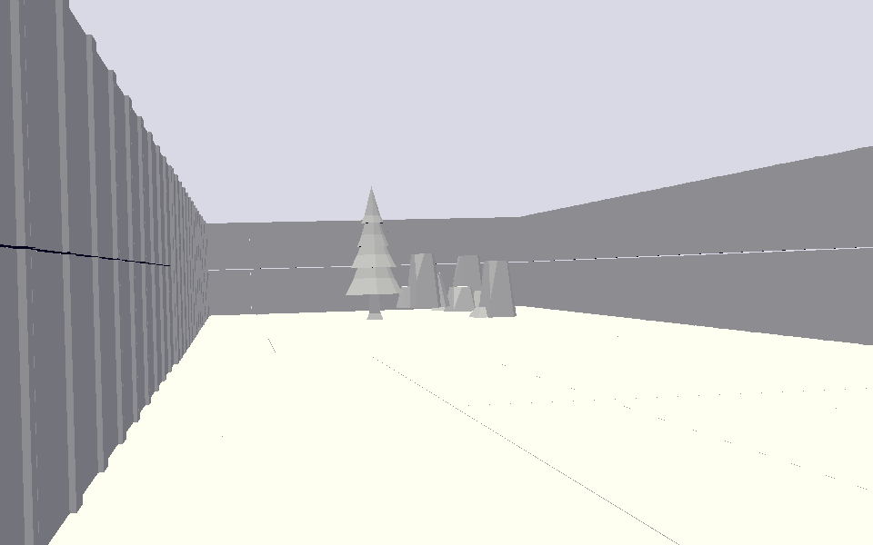

# A Normal Day

Author: Malek Anabtawi

Design: Once again, sadly, there is no game.

Screen Shot:

How To Play:

Walk with wasd, look around with the mouse. If the camera starts tilting, rotate the mouse vigorously. 

Sources:

Assets from the amazing: https://kenney.nl/assets/fantasy-town-kit

Notes of interest:

- Because I was pretty busy this week, and because I didn't have a strong image of any game I wanted to build...yeah.
- I wanted to make a spooky game where the camera keeps staticking, and the player keeps teleporting around and seeing double,
  for what it's worth. With some voice-over, I reckon it would have barely been a game.

This game was built with [NEST](NEST.md).
